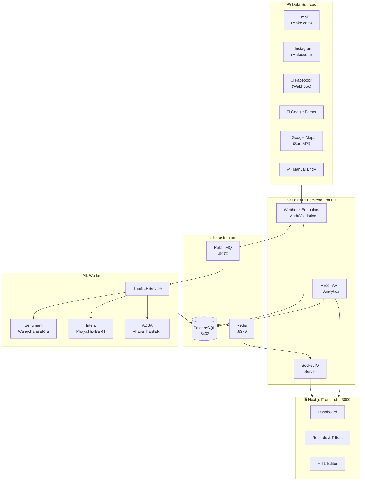

<div align="center">

# 🏟️ VoC Analytics System for Sports Facility Business

**An end-to-end Voice of Customer analytics platform with Thai NLP, real-time dashboards, and human-in-the-loop corrections**

[](https://python.org)
[](https://fastapi.tiangolo.com)
[](https://nextjs.org)
[](https://react.dev)
[](https://postgresql.org)
[](https://docker.com)
[](LICENSE)

</div>

---

## 📋 Overview

VoC Analytics System is a **full-stack, event-driven analytics platform** designed for sports facility businesses (gyms, fitness clubs, sports complexes). It automatically collects customer feedback from **6 channels**, performs **Thai-language NLP analysis** using fine-tuned transformer models, and presents actionable insights through a **real-time interactive dashboard**.

### Key Capabilities

- 🔄 **Multi-Channel Ingestion** — Email, Instagram, Facebook, Google Forms, Google Maps, and manual entry
- 🤖 **Thai NLP Pipeline** — Sentiment analysis, multi-label intent classification, and aspect-based sentiment analysis across 8 facility aspects
- 📊 **Real-Time Dashboard** — KPI cards, trend charts, radar plots, and distribution visualizations with live WebSocket updates
- ✏️ **Human-in-the-Loop** — Edit ML predictions with full audit trail and instant reversion
- ⚡ **Hybrid Intelligence** — Smart routing: survey ratings bypass ML, star ratings serve as sentiment ground truth, text goes through full NLP pipeline

---

## 🏗️ Architecture



---

## 🛠️ Tech Stack

| Layer | Technology |
|:---|:---|
| **Backend** | Python 3.11 · FastAPI · SQLAlchemy 2.0 (async) · Alembic · Pydantic v2 · Pika |
| **ML Worker** | PyTorch · HuggingFace Transformers · 3 fine-tuned Thai NLP models |
| **Frontend** | Next.js 16 (App Router) · React 19 · TypeScript · Tailwind CSS v4 · TanStack Query v5 · Recharts · Socket.IO |
| **Database** | PostgreSQL 15 |
| **Message Queue** | RabbitMQ 3 |
| **Cache / Pub-Sub** | Redis 7 |
| **Infrastructure** | Docker · Docker Compose |

---

## 🤖 ML Models

Three fine-tuned transformer models handle Thai-language NLP:

| Task | Model | Output |
|:---|:---|:---|
| **Sentiment Analysis** | [`poom-sci/WangchanBERTa-finetuned-sentiment`](https://huggingface.co/poom-sci/WangchanBERTa-finetuned-sentiment) | positive / neutral / negative |
| **Intent Classification** | [`unduood/phayathaibert-intent-classification-sports-facility`](https://huggingface.co/unduood/phayathaibert-intent-classification-sports-facility) | feedback · complaint · question · off_topic (multi-label) |
| **Aspect-Based SA** | [`unduood/phayathaibert-absa-sports-facility-v2`](https://huggingface.co/unduood/phayathaibert-absa-sports-facility-v2) | 8 aspects: Equipment · Staff · Cleanliness · Atmosphere · Price · Location · Programs · Amenities |

### Hybrid Processing Strategy

Not all sources need full ML inference:

| Source | Sentiment | Intent | Aspect SA |
|:---|:---|:---|:---|
| **Google Forms** | From 1–5 rating ✅ | Skipped | From per-aspect ratings ✅ |
| **Google Maps** | From star rating ✅ | ML inference 🤖 | ML inference 🤖 |
| **Text sources** (Email, IG, FB, Manual) | ML inference 🤖 | ML inference 🤖 | ML inference 🤖 |

---

## 📸 Screenshots


---

## 📁 Project Structure

```
VoC-Analytics-System-For-Sports-Facility-Business/
├── voc-analytics/
│   ├── backend/                     # FastAPI backend service
│   │   ├── app/
│   │   │   ├── api/v1/endpoints/    # Webhook, feedback, analytics, corrections
│   │   │   ├── models/              # SQLAlchemy models
│   │   │   ├── schemas/             # Pydantic validation schemas
│   │   │   ├── services/            # Business logic layer
│   │   │   ├── websocket/           # Socket.IO + Redis subscriber
│   │   │   ├── main.py              # App entrypoint & lifespan
│   │   │   ├── config.py            # Environment settings
│   │   │   └── database.py          # Async DB engine
│   │   ├── alembic/                 # Database migrations
│   │   ├── Dockerfile
│   │   └── requirements.txt
│   │
│   ├── worker/                      # ML inference worker
│   │   ├── app/
│   │   │   ├── models/              # Shared SQLAlchemy models
│   │   │   ├── services/            # Redis publisher
│   │   │   ├── main.py              # RabbitMQ consumer + processing pipeline
│   │   │   ├── nlp_service.py       # Thai NLP model loader & inference
│   │   │   └── database.py          # Async DB session
│   │   ├── Dockerfile
│   │   └── requirements.txt
│   │
│   ├── frontend/                    # Next.js dashboard
│   │   ├── src/
│   │   │   ├── app/                 # Pages: dashboard, records, manual
│   │   │   ├── components/          # UI components, charts, editors
│   │   │   ├── context/             # Dashboard date filter context
│   │   │   └── hooks/               # Custom hooks (realtime, feedback, etc.)
│   │   ├── Dockerfile
│   │   └── package.json
│   │
│   ├── docker-compose.yml
│   └── .env.example
│
├── thai_nlp_inference_unified.ipynb  # ML model inference notebook & documentation
└── README.md
```

---

## 🚀 Getting Started

### Prerequisites

- [Docker](https://docs.docker.com/get-docker/) & [Docker Compose](https://docs.docker.com/compose/install/)
- ~3 GB RAM for ML models (first run downloads from HuggingFace)

### Installation

**1. Clone the repository**

```bash
git clone https://github.com/unduood/VoC-Analytics-System-For-Sports-Facility-Business.git
cd VoC-Analytics-System-For-Sports-Facility-Business
```

**2. Configure environment variables**

```bash
cd voc-analytics
cp .env.example .env
```

Edit `.env` and set your secrets:

```env
# Required — change these for production
SECRET_KEY=your-secret-key-here
WEBHOOK_SECRET=your-webhook-secret-here

# Optional — for platform integrations
SERPAPI_KEY=your_serpapi_key              # Google Maps reviews
FACEBOOK_APP_SECRET=your_app_secret      # Facebook webhook
FACEBOOK_PAGE_ACCESS_TOKEN=your_token    # Facebook Graph API
```

**3. Start all services**

```bash
docker-compose up -d
```

**4. Access the application**

| Service | URL |
|:---|:---|
| 🖥️ **Frontend Dashboard** | http://localhost:3000 |
| ⚙️ **Backend API** | http://localhost:8000 |
| 📖 **API Documentation** | http://localhost:8000/docs |
| 🐰 **RabbitMQ Management** | http://localhost:15672 |

> [!NOTE]
> On the first run, the ML worker will download ~1.5 GB of model weights from HuggingFace. These are cached in a Docker volume (`huggingface_cache`) for subsequent runs.

---

## 📡 API Endpoints

### Webhook Ingestion

All webhook endpoints require `X-Webhook-Token` header authentication.

| Method | Endpoint | Description |
|:---|:---|:---|
| `POST` | `/api/v1/webhooks/email` | Email feedback via Make.com |
| `POST` | `/api/v1/webhooks/instagram` | Instagram comments via Make.com |
| `GET/POST` | `/api/v1/webhooks/facebook` | Facebook Page webhook (HMAC-SHA256) |
| `POST` | `/api/v1/webhooks/google-form` | Google Forms responses |

### Feedback Management

| Method | Endpoint | Description |
|:---|:---|:---|
| `GET` | `/api/v1/feedback` | List with filters, search, and pagination |
| `GET` | `/api/v1/feedback/{id}` | Detail with all analysis results |
| `POST` | `/api/v1/feedback/manual` | Submit manual feedback |
| `DELETE` | `/api/v1/feedback/{id}` | Delete feedback + cascading analysis |

### Analytics & Corrections

| Method | Endpoint | Description |
|:---|:---|:---|
| `GET` | `/api/v1/analytics/overview` | Dashboard KPIs, distributions, aspect scores |
| `GET` | `/api/v1/analytics/trends` | Sentiment trends with auto-granularity |
| `POST` | `/api/v1/google-maps/fetch-reviews` | Fetch Google Maps reviews via SerpAPI |
| `PATCH` | `/api/v1/feedback/{id}/analysis` | Human-in-the-loop corrections |

### System

| Method | Endpoint | Description |
|:---|:---|:---|
| `GET` | `/health` | Health check |
| `GET` | `/docs` | Swagger UI |

---

## 🔗 Integrations

### Make.com (formerly Integromat)

Email and Instagram ingestion use [Make.com](https://www.make.com/) automation scenarios:

1. **Email → Webhook**: Gmail/Outlook trigger → HTTP POST to `/api/v1/webhooks/email`
2. **Instagram → Webhook**: Instagram trigger → HTTP POST to `/api/v1/webhooks/instagram`

Set `X-Webhook-Token` in the HTTP module header to match your `WEBHOOK_SECRET` in `.env`.

### Facebook Page Webhook

Direct webhook integration with [Facebook Graph API](https://developers.facebook.com/docs/graph-api/webhooks/):

- Automatic subscription verification (`hub.challenge`)
- HMAC-SHA256 signature validation (`X-Hub-Signature-256`)
- Handles comment `add`, `edited`, and `remove` events

### Google Forms

Receives structured survey responses via webhook (`POST /api/v1/webhooks/google-form`):

- Accepts 1–5 satisfaction ratings for overall experience and 8 facility aspects (equipment, staff, cleanliness, etc.)
- Ratings are converted directly to sentiment (1–2 → negative, 3 → neutral, 4–5 → positive) — **no ML inference needed**
- Supports optional demographic fields (age group, visit frequency)

### Google Maps Reviews

Fetches reviews via [SerpAPI](https://serpapi.com/) with smart delta updates (detects edited reviews, re-analyzes changed content).

---

## 📓 ML Notebook

The [`thai_nlp_inference_unified.ipynb`](thai_nlp_inference_unified.ipynb) notebook documents and demonstrates the ML inference pipeline:

- Model configuration and HuggingFace repository mapping
- Production-ready service classes (`ABSAService`, `IntentClassificationService`, `SentimentAnalysisService`)
- Unified `ThaiNLPService` with lazy-loading and singleton pattern
- Interactive test suites on sample Thai facility reviews
- FastAPI integration code and Docker deployment guide

---

## 📄 License

This project is licensed under the MIT License — see the [LICENSE](LICENSE) file for details.
